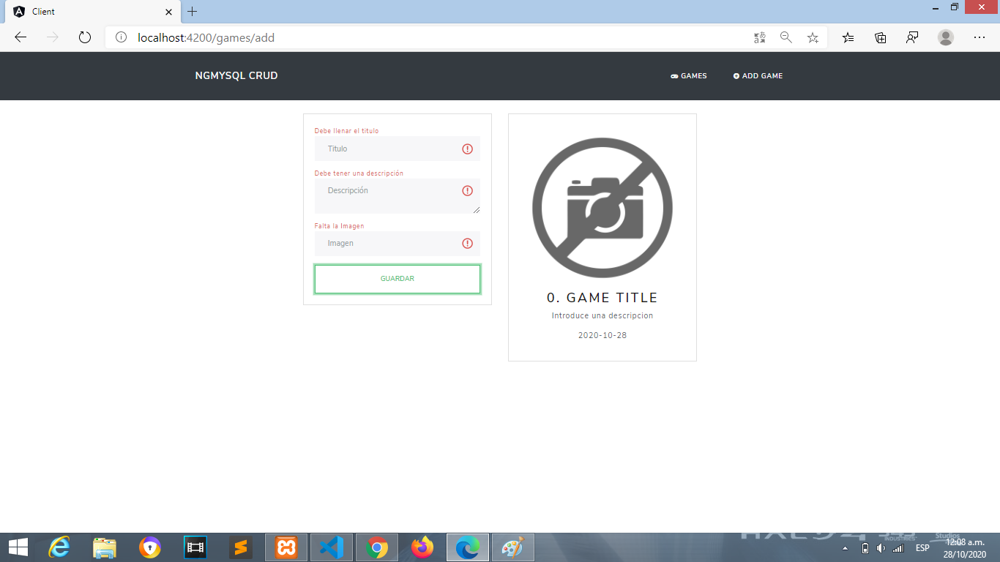

PROYECTO HECHO CON---> NODEJS - ANGULAR - MYSQL

Agradecimientos a  "FaztTech" 

Youtube-tutorial ----> [Ver tutorial](https://www.youtube.com/watch?v=lxYB79ANJM8).

El Proyecto no tenia validaciones y conclui el proyecto con algunos cambios para mejorar el tutorial de FaztTech.

Se agregaron los Modulos de "NgForm" para las validaciones.

# Screenshot

